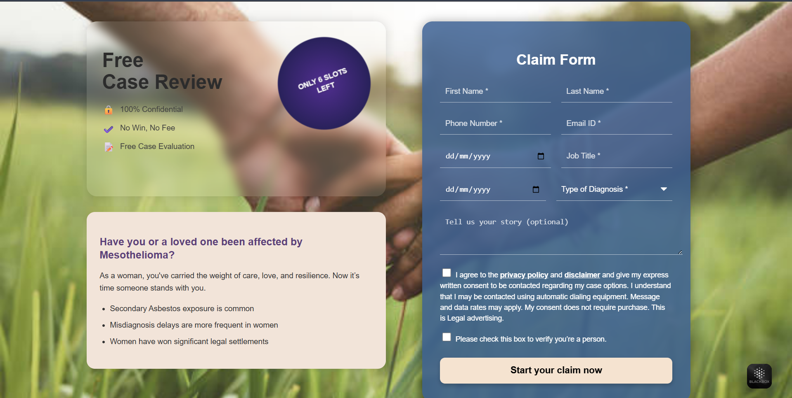

Deployed link : frolicking-gecko-c18463.netlify.app

# 📝 Mesothelioma Legal Claim Form – React Web Application

A modern, responsive legal claim intake form built using **React.js**. Designed for users affected by **Mesothelioma** or other asbestos-related diseases to securely and easily request a free case review from a legal team.

---

## 🚀 Features

- 🧾 Clean and intuitive multi-field claim form
- ✅ Checkbox consents with legal disclaimer
- 💬 Optional message/story input
- 🔒 Highlights confidentiality and privacy
- 📱 Responsive design with elegant UI
- 🎨 Background with blurred glass effect and gradient cards
- 🎯 Emphasizes urgency with limited slot badge
- 👩‍⚖️ Focused messaging for affected women

---

## 📸 Demo

> 

Screenshot:



---

## 🏗️ Tech Stack

| Tech       | Description               |
|------------|---------------------------|
| React.js   | Frontend framework        |
| CSS3       | Styling & layout          |
| HTML5      | Markup                    |
| Vite / CRA | React tooling (any)       |

---

## 🧰 Installation

### 1. Clone the repository

```bash
git clone https://github.com/your-username/mesothelioma-claim-form.git
cd mesothelioma-claim-form
2. Install dependencies
bash
Copy
Edit
npm install
3. Start the development server
bash
Copy
Edit
npm start
App runs at: http://localhost:3000

📁 Project Structure
csharp
Copy
Edit
mesothelioma-claim-form/
│
├── public/
│   └── index.html
│
├── src/
│   ├── components/
│   │   └── ClaimForm.js     # Main React component
│   ├── styles/
│   │   └── ClaimForm.css    # Custom styles
│   └── App.js
│
├── package.json
└── README.md

✍️ Component Features
The form includes:

✅ First name & Last name

📞 Contact number & email

🩺 Diagnosis type & date

👷‍♂️ Job title

🗣️ Personal story input

📦 Checkbox for legal consent

📤 “Start your claim” CTA button

📦 Dependencies
json
Copy
Edit
"dependencies": {
  "react": "^18.x",
  "react-dom": "^18.x",
  "react-scripts": "latest"
}
You may also use Vite instead of CRA (Create React App).

🛡️ License
This project is licensed under the MIT License. See the LICENSE file for details.

🙋‍♀️ Who Is It For?
👩‍⚖️ Legal support teams handling Mesothelioma cases

🏥 Health & wellness platforms

🧑‍💼 Legal awareness campaigns

👨‍👩‍👧‍👦 Family members or victims of asbestos-related diseases

🤝 Contributing
Pull requests are welcome. For major changes, open an issue first to discuss what you’d like to change.

Fork the repo

Create your feature branch (git checkout -b feature/YourFeature)

Commit changes (git commit -m 'Add YourFeature')

Push to the branch (git push origin feature/YourFeature)

Open a pull request

👨‍💻 Author
Developed by Suyash Priyadarshi
